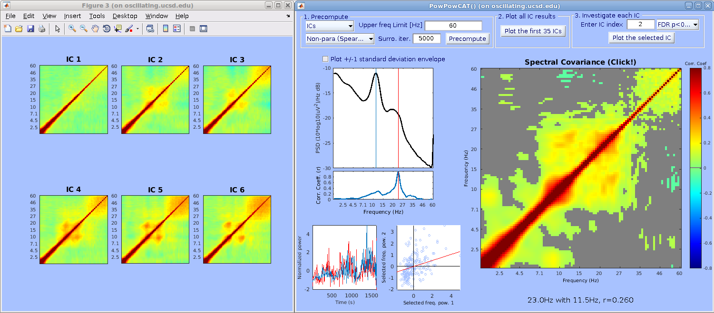

Presentation slides (Click the cat to download)
=================================================

The slides are from the 30th EEGLAB workshop, day two 'Advanced Topics' (June 15, 2021).

The artwork is by Mayumi and Makoto Miyakoshi. All rights reserved!

Download the current version (05/13/2021 updated)
=================================================

[version 2.30]
A bug in the batch process mode fixed.
Now batch process mode supported (it overwrites .set files). Note that it is designed as a
plugin for EEGLAB. If you are using EEGLAB2019 or newer, you can also
download it via EEGLAB extension manager. When you publish data using
this toolbox, please cite the following paper: [Thammasan N, Miyakoshi
M. (2020). Cross-frequency Power-Power Coupling Analysis: A Useful
Cross-Frequency Measure to Classify ICA-Decomposed EEG. *Sensors*.
20:7040.](https://www.mdpi.com/1424-8220/20/24/7040)

How to use it (12/04/2020 added)
================================

1.  On the top left panel, choose whether you analyze electrode data or
    ICA-decomposed data.
2.  Enter the upper frequency limit in Hz.
3.  Choose parametric method (Pearson's correlation coefficient) or
    non-parametric method (Spearman's correlation coefficient). The
    parametric method is sensitive but susceptible to outliers, while
    the non-parametric method is robust but less sensitive. For further
    details, please see our paper (Thammasan and Miyakoshi, 2020).
4.  Set the number of iteration for the permutation test. Default is
    5,000.
5.  Press the button 'Precompute' to start precomputing. It may take
    while, depending on how long your data is and how many
    electrodes/ICs there are.
6.  (Optional) When precompute is done, you may press the button on the
    top middle panel to show the first 35 electrodes/ICs to see the
    overview of the results.
7.  On the top right panel, enter the index of electrode/IC to show the
    results in the main interactive plotting panels. You may show the
    raw correlation coefficients, those masked by p\<0.05 and by p\<0.01
    after false discovery rate (FDR) correction.

Results comparison (12/04/2020 added)
=====================================

These are the selected independent components (ICs) with
ICLabel-generated probabilistic labels.

Here is the comparison between PPC Pearson's correlation coefficient
(left) with Spearman's correlation coefficient (right). The input data
was continuous. The comodulogram is thresholded at FDR-corrected
p\<0.01. In the comodulogram, 11.5Hz-23.0Hz is selected. Note Pearson'
correlation is slightly more sensitive. Pearson's correlation is
calculated after removing 20% of outliers, while Spearman's correlation
is robust so data rejection is not applied.

The same comparison with the same but epoched data. The comodulogram is
thresholded at FDR-corrected p\<0.05. In the comodulogram, 11.5Hz-23.0Hz
is selected. Note that sensitivity is reduced in the epoched data
analysis.

The difference between the continuous and epoched data analysis is that
for the former, 1-s sliding window with overlap of 50% is applied to
obtain spectrogram, while for the latter, each epoch served as windows
to analyze. Generally, it is recommended that you go back to the
continuous data and apply the analysis. The results from the
sliding-window calculation capturing 'boundary' events are excluded to
avoid the boundary effect.

What it does
============

-   It computes within-IC cross-frequency power-power coupling
    (covariance) called 'comodugram/comodulogram' (see references below)
    for a single-subject continuous IC activation.
-   The preprocessing pipeline is as follows:
-   Performs Matlab spectrogram() (hence it requires Matlab Signal
    Processing Toolbox) to compute spectrogram and power spectrum
    density (PSD) as its temporal average using 1-s window with 50%
    overlap and with modified () logarithmically-spaced frequency bins.

`deviationFromLog = 5;`
`freqBins = logspace(log10(1+deviationFromLog), log10([user_input_value]+deviationFromLog), 100)-deviationFromLog;`

-   Finds boundary event in EEGLAB and removes the chunks that contain
    boundaries.
-   Compute median across all the chunks to compute robust spectra, and
    compute the variance to discard 20% of chunks for cleaning.
-   Compute covariance matrices of cross-frequency power spectrum for
    all the ICs (hence pre-selecting ICs is recommended; see [this
    page](https://sccn.ucsd.edu/wiki/Std_selectICsByCluster) for how to
    perform it efficiently.)
-   Performs permutation statistics by randomizing chunk (i.e.
    datapoint) indices differently for each frequency bin to build
    surrogate time-frequency data, apply the same covariance
    calculation, and repeat these processes for 5,000 times. Finally,
    the observed (i.e. the real) covariance values are tested against
    the surrogate distribution using non-parametric method,
    stat_surrogate_pvals(). For multiple comparison correction, false
    discovery rate (FDR) is computed across all ICs and all pixels.
-   By using mouse cursor, one can explore the frequency-frequency plot
    interactively and intuitively. The combination of frequency ranges
    as well as the correlation coefficient of the selected combination
    are shown.
-   The subsampled time-courses of the two frequencies are shown in the
    bottom left plot.
-   The scatter plot of the two time-series data are shown.

Demonstration
=============

EEGLAB workshop tutorial data 'stern_125.set' was analyzed. The
continuous 71-ch data were low-pass filtered at 50Hz, and non-brain ICs
were rejected manually. The overall results are shown below.

For example, IC6 and IC8 look similar in terms of their scalp topography
and frequency spectra. However, when you compare their cross-frequency
power correlations, the difference is clearer. Compare the difference of
10Hz-20Hz peak in the bottom-left box bewtween IC6 and IC8.

The analysis revealed complex cross-frequency power coupling structure
in IC15 and IC21. For example, IC15 showed 11Hz, 22Hz, 33Hz, and 44Hz
peaks as 2nd, 3rd, and 4th harmonics. Note that the 4th harmonics can be
seen more clearly in the correation coefficient plot than that in the
PSD plot, indicating better sensitivity of this method to detect
cross-frequency power-power coupling structure.

Reference
=========

[Thammasan N, Miyakoshi M. (2020). Cross-frequency Power-Power Coupling
Analysis: A Useful Cross-Frequency Measure to Classify ICA-Decomposed
EEG. *Sensors*. 20:7040 .](https://www.mdpi.com/1424-8220/20/24/7040)

Sterman MB, Kaiser D. (2000). Comodulation: A new QEEG analysis metric
for assessment of structural and functional disorders of the central
nervous system. *Journal of Neurotherapy*. 4:73-83.

Buzsaki G, Buhl DL, Harris KD, Csicsvari J, Czeh B, Morozov A. (2003).
Hippocampal network patterns of activity in the mouse. *Neuroscience*.
116:201-211.

Csicsvari J, Jamieson B, Wise KD, Buzsaki G. (2003). Mechanisms of Gamma
Oscillations in the Hippocampus of the Behaving Rat. *Neuron*.
37:311-322.

Thatcher RW, Biver CJ, North DM. (2004). EEG and Brain Connectivity: A
Tutorial. *Unpublished manuscript, PDF available online*.

Sullivan D, Csicsvari J, Mizuseki K, Montgomery S, Diba K, Buzsaki G.
(2011). Relationships between hippocampal sharp waves, ripples, and fact
gamma oscillation: infludence of dentate and entorhinal cortical
activity. *The Journal of Neuroscience*. 31:8605-8616.

Buzsaki G, Wang X-J. (2012). Mechanisms of Gamma Oscillations. *Annu Rev
Neurosci*. 35:203-225.

Jirsa V, Mueller V. (2013). Cross-frequency coupling in real and virtual
brain networks. *Frontiers in Computational Neuroscience*. 7:78.

Zobay O, Adjamian P. (2015). Source-Space Cross-Frequency
Amplitude-Amplitude Coupling in Tinnitus. *BioMed Research
International*. 2015:489619.

Yeh C-H, Lo MT, Hu K. (2016). Spurious cross-frequency
amplitude-amplitude coupling in nonstationary, nonlinear signals.
Physica A. 454:453-150.

Acknowledgement
===============

I express my gratitude to Drs. Gyorgy Buzsaki and Tim Mullen for
informative communication.

(This page was written by Makoto Miyakoshi)
